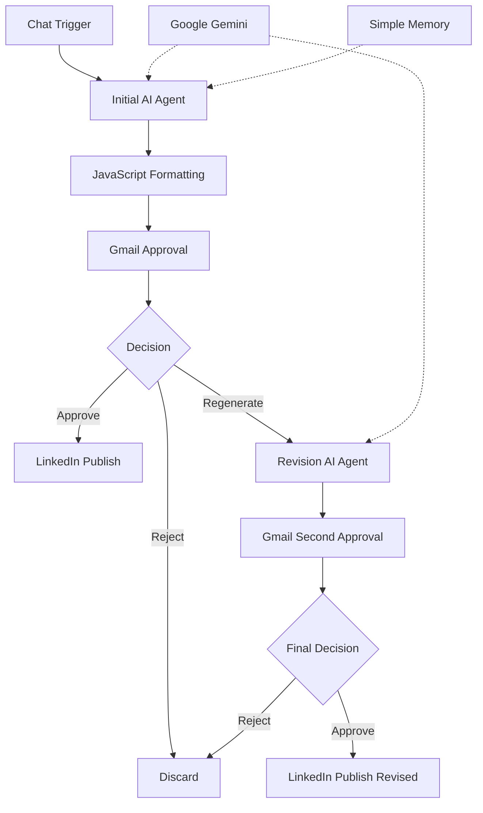

# Architecture & Node Rationale

## System Overview

LinkedIn Automation AI is an n8n-based human-in-the-loop content pipeline.



## Node-by-Node

### Chat Trigger
Receives the user's topic or content idea.

### Initial AI Agent
Creates the first LinkedIn draft using the configured content structure, tone, word limit, engagement question, and hashtags.

### Google Gemini Chat Model
Provides the language model for the AI agents.

### Simple Memory
Provides conversational context to the initial agent.

### JavaScript Nodes
Inspect and normalize generated text, including newline handling.

### Gmail Approval
Sends the draft to the user and waits for a decision: **Yes**, **No**, or **Regenerate**, with optional feedback.

### Switch / If
Routes the workflow based on the human decision.

### Revision AI Agent
Receives the original post and user feedback, then creates an improved version.

### Second Gmail Approval
Presents the revised post for final approval.

### LinkedIn Nodes
Publish only after the corresponding approval path is accepted.

## Human-in-the-Loop Boundary

```text
AI creates → Human reviews → Human decides → LinkedIn
```

AI does not have unconditional publishing authority.

## Integration Map

| Integration | Role |
|---|---|
| n8n | Workflow orchestration |
| Google Gemini | Generation and revision |
| Gmail | Approval and feedback |
| LinkedIn | Publication |
| JavaScript | Transformation |
| Simple Memory | Initial agent context |

## Failure Boundaries

The workflow should fail safely when AI output is unusable, approval is unavailable or ambiguous, credentials are invalid, or LinkedIn publishing fails. Explicit error branches and execution logging are future improvements.

## Security Boundary

Credentials belong in n8n Credentials. Never commit Gemini keys, Gmail OAuth tokens, LinkedIn OAuth tokens, personal email addresses, account identifiers, or private webhook secrets.

## Future Architecture

```text
Content Idea → Topic Intelligence → Brand Voice → Content Agent
      → Quality Check → Approval Workspace → Scheduler → LinkedIn
      → Analytics → Performance Feedback → Content Agent
```

The future architecture is a product direction, not current functionality.
